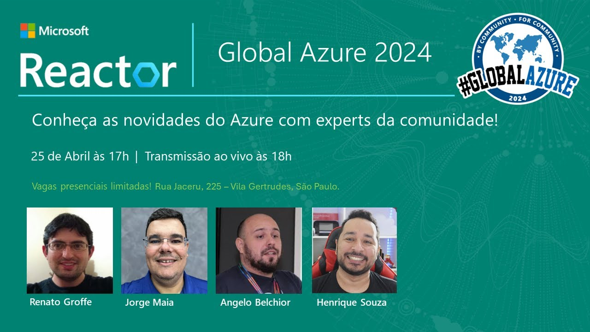

# GlobalAzure-SaoPaulo-2024
Fotos e informações gerais sobre o evento "Global Azure", realizado em 25/04/2024 na cidade de São Paulo-SP.

--- 

Organizadores:
- **Renato Groffe (Microsoft MVP, MTAC)**
- **Jorge Maia (Microsoft MVP)**
- **Angelo Belchior (Microsoft MVP, MTAC)**
- **Henrique Souza (Microsoft MVP)**

Número de participantes: **24 pessoas**

Apresentações:
1) _IA em projetos de transformação digital com Azure - Jorge Maia (Microsoft MVP)_
2) _MFA e Azure AD B2C - implementando autenticação multifator em poucos cliques! - Renato Groffe (Microsoft MVP, MTAC)_
3) _O Que É e Como Implementar Avatares Quase Reais com Azure Speech - Angelo Belchior (Microsoft MVP, MTAC) e Henrique Souza (Microsoft MVP)_

Tecnologias e tópicos abordados: **Inteligência Artificial, OpenAI, Azure OpenAI, Copilot, Azure AD B2C, Microsoft Entra ID, .NET, ASP.NET Core...**

Acesse este [**link**](/img/) para visualizar todas as fotos das apresentações.

Link da transmissão: [**YouTube**](https://www.youtube.com/watch?v=Hdtl3lvgYcI)

Formulário utilizado para inscrições: [**Microsoft Reactor**](https://developer.microsoft.com/pt-br/reactor/events/22160/?wt.mc_id=1reg_22160_webpage_reactor)

Local: Microsoft Reactor - Rua Jaceru, 225 - Vila Gertrudes - São Paulo - SP - CEP: 04705-000

Deixamos aqui nossos agradecimentos ao Victor Temple e à Larissa Cyganski pela oportunidade e todo o apoio para promovermos esta edição local do .NET Conf no Microsoft Reactor em São Paulo-SP.

---

